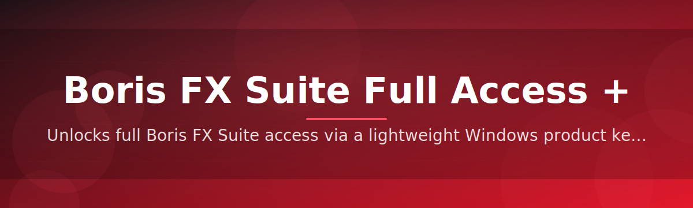

# 🧩 Boris FX Suite Full Access + Product Key License Patch

### ⭐ Star this repo if it helped you!

  

---

## Table of Contents

- [About](#about)
- [Requirements](#requirements)
- [Features](#features)
- [Installation](#installation)
- [FAQ](#faq)
- [Community / Support](#community--support)
- [License](#license)
- [Disclaimer](#disclaimer)
- [Download](#download)

---

## About

**What this is NOT:** a cracked installer, a keygen server, or a modified copy of Boris FX binaries.

What it **is**: a lightweight Windows utility that edits local license configuration files so that Boris FX Suite tools recognize a full-access product key state. It ships as a single standalone `.exe` — no interpreter, no dependencies, no build step.

> [!NOTE]
> The tool only touches local configuration entries. It does not connect to Boris FX activation servers and does not redistribute any proprietary plugin code.

> [!TIP]
> Run the tool once per Boris FX installation. Re-running after a suite update is usually unnecessary unless the vendor resets config paths.

---

## Requirements

| Requirement | Details |
|---|---|
| OS | Windows 10 or later (64-bit) |
| Runtime | None — standalone `.exe` |
| Permissions | Local admin rights recommended |
| Disk | Under 20 MB free space |

> [!IMPORTANT]
> Close all Boris FX host applications (host editors and standalone tools) before running the patch. Config files locked by a running process cannot be edited.

---

## Features

| Feature | Description |
|---|---|
| Standalone `.exe` | Single-file distribution, no Python or package manager required |
| Full-access flag write | Sets local config entries to reflect a full-suite license state |
| Config backup | Creates a timestamped backup before any file is modified |
| Path auto-detection | Locates common Boris FX install directories automatically |
| Manual path override | Lets you point the tool at a custom install location |
| Dry-run mode | Preview changes without writing to disk |
| Rollback support | Restore the original config from the generated backup |
| Log output | Writes a plain-text log of every action taken |

---

## Installation

1. **Download** the release archive using the button at the top or bottom of this page.
2. **Extract** the `.zip` to any writable folder — no installer wizard is involved.
3. **Run** the `.exe`. Windows SmartScreen may prompt for confirmation on first launch.
4. **Follow** the on-screen steps: pick the install path, review the dry-run summary, then apply.

---

## FAQ

**Does this require Python or any runtime?**
No. It is a compiled standalone `.exe` — download and run.

**Will it modify Boris FX program files?**
No. It only edits local license configuration entries, not the application binaries.

**Can I undo the changes?**
Yes. Every run creates a backup automatically before writing, and the tool includes a rollback option.

> [!TIP]
> Use dry-run mode first if you want to review exactly which config keys will change before committing.

**Does it work with every Boris FX product version?**
Coverage depends on config schema per release. Check the Releases page for the tested version list.

---

## Community / Support

- **Issues** — report bugs or unexpected config behavior via the Issues tab.
- **Discussions** — ask setup questions or share compatibility notes.
- **Contributions** — pull requests for path-detection improvements are welcome.

---

## License

Released under the **MIT License**, 2026. See `LICENSE` for full terms.

---

## Disclaimer

> [!CAUTION]
> This project is provided for educational and interoperability purposes. Boris FX is a trademark of its respective owner, and this repository is not affiliated with or endorsed by Boris FX. Modifying license configuration on software you do not have rights to may violate the vendor's terms of service. Use at your own risk.

---

## Download

  

